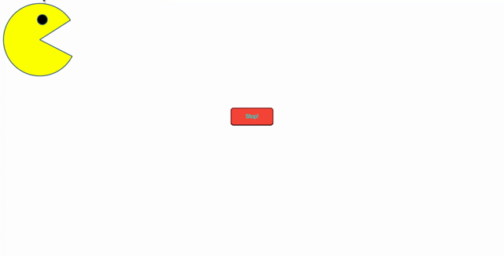

# Pac-Man on the Go!
'Pac-Man on the Go' is a fun project to make the Pac-Man move from one edge to the other edge and then change its directon.

**What I Learned**
- How to use setInterval() for continuous movement of Pac-Man
- How to stop setInterval()

## Description
- Pac-Man starts to move from left to right with interchanging images.
- Once it reaches the right most edge of the screen it changes its direction.
- It starts to move from right to left with interchanging images.
- Once it reaches left most edge of the screen it changes it direction.
- At any point in time one can stop the Pac-Man movement by clicking **Stop** button.

## Installation
git clone https://github.com/vanisbala/PacMan-OnTheGo

## Built with
- [HTML](https://developer.mozilla.org/en-US/docs/Web/HTML)
- [JavaScript](https://developer.mozilla.org/en-US/docs/Web/Javascript)

## Deployed Link
- [See live Site](https://vanisbala.github.io/PacMan-OnTheGo/)

## Pac-Man on the Go demo

## Author
### Vani 
- [Link to Github](https://github.com/vanisbala)

## Credits
Thanks to MITxPRO for giving me the opportunity to work on this fun project.

**Tutorials**
- https://www.w3schools.com/css/css3_buttons.asp
- https://stackoverflow.com/questions/109086/stop-setinterval-call-in-javascript
